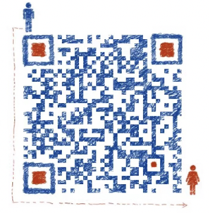

# note

## 讨论区

https://github.com/nzcv/note/discussions/categories/q-a

## Arm64汇编学习(B站视频, 欢迎关注)

<iframe src="//player.bilibili.com/player.html?isOutside=true&aid=113265988408477&bvid=BV1Gg1mYrEyZ&cid=26195266389&p=1" scrolling="no" border="0" frameborder="no" framespacing="0" allowfullscreen="true"></iframe>

## Arm64汇编学习(站在编译器的角度学习)

[01.Arm寄存器](https://github.com/nzcv/note/tree/master/arm/01register.md)

[02.Arm32读PC寄存器](https://github.com/nzcv/note/tree/master/arm/02read_pc.md)

[03.Arm数据访问指令](https://github.com/nzcv/note/tree/master/arm/03data_processing.md)

[04.Arm读取状态寄存器](https://github.com/nzcv/note/tree/master/arm/04msr_mrs.md)

[05.Arm整数移位除法](https://github.com/nzcv/note/tree/master/arm/05div.md)

[06.Arm调用约定](https://github.com/nzcv/note/tree/master/arm/06args.md)

[07.Arm条件指令](https://github.com/nzcv/note/tree/master/arm/07condition.md)

[08.Arm64堆栈保护机制](https://github.com/nzcv/note/tree/master/arm/08canary.md)

[09.Arm IF Switch对应实现](https://github.com/nzcv/note/tree/master/arm/09if_switch.md)

[10.NZCV标志位](https://github.com/nzcv/note/tree/master/arm/10nzcv.md)

[11.ForWhile汇编解析](https://github.com/nzcv/note/tree/master/arm/11for_while.md)

[12.堆栈对齐stack_aligin汇编解析.md](https://github.com/nzcv/note/tree/master/arm/12stack_aligin.md)

[13.数组array汇编解析.md](https://github.com/nzcv/note/tree/master/arm/13array.md)

[14.结构体struct汇编解析.md](https://github.com/nzcv/note/tree/master/arm/14struct.md)

[15.指针pointer汇编解析.md](https://github.com/nzcv/note/tree/master/arm/15pointer.md)

[16.移位位运算汇编解析.md](https://github.com/nzcv/note/tree/master/arm/16bit_operand.md)

[17.逻辑位运算汇编解析.md](https://github.com/nzcv/note/tree/master/arm/17logic_operand.md)

## Arm64相关文档

[Arm64官方手册_查阅C6.2](https://github.com/nzcv/note/releases/download/note_books/DDI0487G_a_armv8_arm.pdf)

## ELF文件解析与自己编写linker

https://github.com/nzcv/note/tree/master/linker/00elf.md

https://github.com/nzcv/note/tree/master/linker/01elfheader.md 

https://github.com/nzcv/note/tree/master/linker/02mmap.md

https://github.com/nzcv/note/tree/master/linker/05symtab.md

https://github.com/nzcv/note/tree/master/linker/06import_dyn.plt.md

https://github.com/nzcv/note/tree/master/linker/07hasthtable.md

https://github.com/nzcv/note/tree/master/linker/08dyn.rel.md

https://github.com/nzcv/note/tree/master/linker/09section.md

代码实现:

https://github.com/nzcv/note/releases/download/note_books/mylinker.zip

## NDK对应clang版本号

```shell
android-ndk-r20  -> clang version 8.0.7
android-ndk-r21e -> clang version 9.0.9
android-ndk-r22b -> clang varsion 11.0.5 (match https://godbolt.org/)
```

## 其他帮助学习网站

[https://yifengyou.gitbooks.io/learn-c/content/](https://yifengyou.gitbooks.io/learn-c/content/)

[https://www.one-tab.com/page/KxuI8ZPrQh66sloC1hb0gg](https://www.one-tab.com/page/KxuI8ZPrQh66sloC1hb0gg)

[https://github.com/keystone-engine/keypatch](https://github.com/keystone-engine/keypatch)

[31寸显示器你需要它](https://rectangleapp.com/)

## Join Us(定期拉群)




